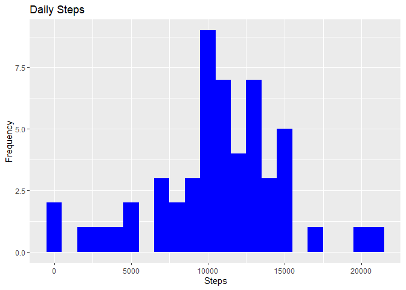

Introduction
------------

This is the report for the solutions of the week 2 project of the
reproducible research coursera course.

Taken from the assignment description: It is now possible to collect a
large amount of data about personal movement using activity monitoring
devices such as a Fitbit, Nike Fuelband, or Jawbone Up. These type of
devices are part of the “quantified self” movement – a group of
enthusiasts who take measurements about themselves regularly to improve
their health, to find patterns in their behavior, or because they are
tech geeks. But these data remain under-utilized both because the raw
data are hard to obtain and there is a lack of statistical methods and
software for processing and interpreting the data.

This assignment makes use of data from a personal activity monitoring
device. This device collects data at 5 minute intervals through out the
day. The data consists of two months of data from an anonymous
individual collected during the months of October and November, 2012 and
include the number of steps taken in 5 minute intervals each day.

Data
----

The data for this assignment can be downloaded from the course web site:

Dataset: \[Activity monitoring data\]
(<a href="https://d396qusza40orc.cloudfront.net/repdata%2Fdata%2Factivity.zip" class="uri">https://d396qusza40orc.cloudfront.net/repdata%2Fdata%2Factivity.zip</a>)
The variables included in this dataset are:

steps: Number of steps taking in a 5-minute interval (missing values are
coded as NA)

date: The date on which the measurement was taken in YYYY-MM-DD format

interval: Identifier for the 5-minute interval in which measurement was
taken

The dataset is stored in a comma-separated-value (CSV) file and there
are a total of 17,568 observations in this dataset.

Prerequisites
-------------

Load the dataset and necessary libraries.

``` r
library(ggplot2)

if (!file.exists("project_data.zip")) {
  download.file("https://d396qusza40orc.cloudfront.net/repdata%2Fdata%2Factivity.zip", "project_data.zip")
  
  # Unzip the dataset 
  unzip("project_data.zip")
}

# Read dataset
data <- read.csv("activity.csv")
```

What is mean total number of steps taken per day?
-------------------------------------------------

1.  Make a histogram of the total number of steps taken each day

``` r
total_steps_by_day <- aggregate(data$steps, by=list(Date=data$date), FUN=sum)
ggplot(total_steps_by_day, aes(x)) +
    geom_histogram(fill = "blue", binwidth = 1000) +
    labs(title = "Daily Steps", x = "Steps", y = "Frequency")
```

    ## Warning: Removed 8 rows containing non-finite values (stat_bin).



2.Calculate and report the mean and median total number of steps taken
per day

``` r
mean_steps <- mean(total_steps_by_day$x, na.rm=TRUE)
median_steps <- median(total_steps_by_day$x, na.rm=TRUE)

print(paste0("The mean is ", round(mean_steps, 2), " and the median is ", median_steps))
```

    ## [1] "The mean is 10766.19 and the median is 10765"

What is the average daily activity pattern?
-------------------------------------------

1.  Make a time series plot (i.e. type = “l”) of the 5-minute interval
    (x-axis) and the average number of steps taken, averaged across all
    days (y-axis)

``` r
steps_by_interval <- aggregate(data$steps, by=list(Interval=data$interval), FUN=mean, na.rm = TRUE)
ggplot(steps_by_interval, aes(x = Interval , y = x)) + geom_line(color="blue", size=1) + labs(title = "Avg. Daily Steps", x = "Interval", y = "Average. Steps per day")
```


1.  Which 5-minute interval, on average across all the days in the
    dataset, contains the maximum number of steps?

``` r
print(steps_by_interval[steps_by_interval$x == max(steps_by_interval$x),])
```

    ##     Interval        x
    ## 104      835 206.1698

Imputing missing values
-----------------------

1.  Calculate and report the total number of missing values in the
    dataset (i.e. the total number of rows with NAs)

``` r
print(nrow(data[is.na(data$steps),]))
```

    ## [1] 2304

1.  Devise a strategy for filling in all of the missing values in the
    dataset. The strategy does not need to be sophisticated. For
    example, you could use the mean/median for that day, or the mean for
    that 5-minute interval, etc.

Impute with mean of intervals

``` r
fill.value <- function(steps, interval) {
    filled <- NA
    if (!is.na(steps))
        filled <- c(steps)
    else
        filled <- (steps_by_interval[steps_by_interval$Interval==interval, "x"])
    return(filled)
}
filled.data <- data
filled.data$steps <- mapply(fill.value, filled.data$steps, filled.data$interval)
```

1.  Create a new dataset that is equal to the original dataset but with
    the missing data filled in

``` r
write.csv(filled.data, file = "imputed_data.csv")
```

1.  Make a histogram of the total number of steps taken each day and
    Calculate and report the mean and median total number of steps taken
    per day. Do these values differ from the estimates from the first
    part of the assignment? What is the impact of imputing missing data
    on the estimates of the total daily number of steps?

``` r
total_steps_by_day2 <- aggregate(filled.data$steps, by=list(Date=filled.data$date), FUN=sum)
ggplot(total_steps_by_day2, aes(x)) +
    geom_histogram(fill = "blue", binwidth = 1000) +
    labs(title = "Daily Steps", x = "Steps", y = "Frequency")
```


``` r
mean_steps2 <- mean(total_steps_by_day2$x, na.rm=TRUE)
median_steps2 <- median(total_steps_by_day2$x, na.rm=TRUE)

print(paste0("The mean is ", round(mean_steps2, 2), " and the median is ", median_steps2))
```

    ## [1] "The mean is 10766.19 and the median is 10766.1886792453"

Are there differences in activity patterns between weekdays and weekends?
-------------------------------------------------------------------------

1.  Create a new factor variable in the dataset with two levels –
    “weekday” and “weekend” indicating whether a given date is a weekday
    or weekend day

``` r
make.factor <- function(date) {
    day <- weekdays(date)
    if (day %in% c("Montag", "Dienstag", "Mittwoch", "Donnerstag", "Freitag"))
        return("weekday")
    else if (day %in% c("Samstag", "Sonntag"))
        return("weekend")
    else
        stop("invalid date")
}
filled.data$date <- as.Date(filled.data$date)
filled.data$day <- sapply(filled.data$date, FUN=make.factor)
```

1.  Make a panel plot containing a time series plot (i.e. type = “l”) of
    the 5-minute interval (x-axis) and the average number of steps
    taken, averaged across all weekday days or weekend days (y-axis).

``` r
averages <- aggregate(steps ~ interval + day, data=filled.data, mean)
ggplot(averages, aes(interval, steps)) + geom_line() + facet_grid(day ~ .) +
    xlab("5-minute interval") + ylab("Number of steps")
```


